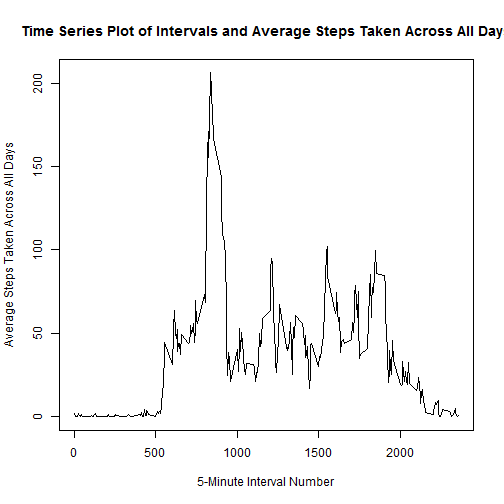

### Loading and Preprocessing the Data
1. Load the data using read.csv()


```r
activity <- read.csv(file="activity.csv", header=TRUE, sep = ",")
```


2. Process/transform the data into a format suitable for my analysis
I am grouping the data by date for use later in this assignment


```r
library(dplyr)
activitydate <- group_by(activity, date)
```


### What is the mean total number of steps taken per day?
For this part of the assignment, I am ignoring the missing values in the dataset.

1. Calculate the total number of steps take per day


```r
stepsperday <- summarise(activitydate, sum(steps))
```


2. Make a histogram of the total number of steps taken each day


```r
# Create column names for stepsperday
colnames(stepsperday) <- c("Date", "Total Steps")
library(ggplot2)
qplot(stepsperday$`Total Steps`, geom="histogram",
      main = "Histogram for Total # of Steps Taken Each Day",
      xlab = "Total Steps Taken Each Day")
```

 

Calculate and report the mean and median of the total number of steps taken per day.


```r
meansteps <- mean(stepsperday$`Total Steps`, na.rm = TRUE)
mediansteps <- median(stepsperday$`Total Steps`, na.rm = TRUE)

cat("Mean steps per day = ", meansteps)
```

```
## Mean steps per day =  10766.19
```

```r
cat("Median steps per day = ", mediansteps)
```

```
## Median steps per day =  10765
```


### What is the average daily activity pattern?
For this part of the assignment, I am grouping each 5-minute interval across all days

1. Make a time series plot (i.e. type = "1") of the 5-minute interval (x-axis) and the average number of steps taken, averaged across all days (y-axis)
I am interpreting this as follows -- the x-axis represents each 5-minute interval across a day -- the y-axis represents the average number of steps taken, across all days, for each 5-minute interval


```r
actbyint <- group_by(activity, interval)
meanact <- summarise(actbyint, mean(steps, na.rm = TRUE))
colnames(meanact) <- c("Interval", "Mean Steps per Day")
plot(meanact$Interval, meanact$`Mean Steps per Day`, type = "l",
     main = "Time Series Plot of Intervals and Average Steps Taken Across All Days",
     xlab = "5-Minute Interval Number",
     ylab = "Average Steps Taken Across All Days")
```

 


2. Which 5-minute interval, on average across all days in the dataset, contains the maximum number of steps?


```r
maxrow <- which.max(meanact$`Mean Steps per Day`)
maxintnum <- meanact[maxrow, 1]

paste("Interval number ", maxintnum, ", on average across all days in the dataset, contains the maximum number of steps.", sep = "")
```

```
## [1] "Interval number 835, on average across all days in the dataset, contains the maximum number of steps."
```


### Inputting missing values

1. Calculate and report the total number of missing values in the dataset (i.e. the total number of rows with NAs)


```r
numna <- sum(is.na(activity$steps))
paste("The total number of missing values in the dataset is ", numna, ".", sep = "")
```

```
## [1] "The total number of missing values in the dataset is 2304."
```


2. Devise a strategy for filling in all of the missing values in the dataset.
My strategy is to use the mean value for that respective day.


```r
# Calculate the mean number of steps per day for each day
meanstepsperday <- summarise(activitydate, mean(steps))
meanstepsperday[is.na(meanstepsperday)] <- 0

# Strategy --> Match the "NAs" in the main activity data with the respective means for the respective days
# activity --> main data, meanstepsperday --> mean steps data, fullactivity --> main data with filled values for missing data
```


3. Create a new dataset that is equal to the original dataset but with the missing data filled in.


```r
fullactivity <- activity
fullactivity$steps[is.na(fullactivity$steps)] <- meanstepsperday$`mean(steps)`[match(fullactivity$date, meanstepsperday$date)]
```


4. Make a histogram of the total number of steps taken each day and Calculate and report the mean and median total number of steps taken per day. Do these values differ from the estimates from the first part of the assignment? What is the impact of imputing missing data on the estimates of the total daily number of steps?


```r
# Group data by total number of steps taken each day
fullstepsperday <- group_by(fullactivity, date)
library(ggplot2)
qplot(fullstepsperday$steps, geom="histogram",
      main = "Histogram for Total # of Steps Taken Each Day",
      xlab = "Total Steps Taken Each Day")
```

 


```r
meantotsteps <- mean(fullstepsperday$steps, na.rm = TRUE)
mediantotsteps <- median(fullstepsperday$steps, na.rm = TRUE)

cat("Mean steps per day = ", meantotsteps)
```

```
## Mean steps per day =  36.08441
```

```r
cat("Median steps per day = ", mediantotsteps)
```

```
## Median steps per day =  0
```

These values differ from the estimates from the first part of the assignment. Imputing missing data on the estimates of the total daily number of steps reduced both the mean and median total number of steps taken per day.


### Are there differences in activity patterns between weekdays and weekends?
I am using the dataset with the filled-in missing values for this part (fullstepsperday).

1. Create a new factor variable in the dataset with two levels - "weekday" and "weekend" indicating whether a given date is a weekday or weekend day.


```r
# Add a column with the day of the week for each row
newfull <- mutate(fullactivity, day = weekdays(as.Date(fullactivity$date), abbr = TRUE))

# Change "Sat" and "Sun" days to "weekend"
newfull$day[newfull$day == "Sat" | newfull$day == "Sun"] <- "weekend"
newfull$day[newfull$day == "Mon" | newfull$day == "Tue" | newfull$day == "Wed" | newfull$day == "Thu" | newfull$day == "Fri"] <- "weekday"
```


2. Make a panel plot containing a time series plot (i.e. type = "l") of the 5-minute interval (x-axis) and the average number of steps taken, averaged across all weekday days or weekend days (y-axis). See the README file in the GitHub repository to see an example of what this plot should look like using simulated data.


```r
# Full
fullactbyint <- group_by(newfull, interval)
meanfullactbyint <- summarise(fullactbyint, mean(steps, na.rm = TRUE))
colnames(meanfullactbyint) <- c("Interval", "Mean Steps per Day")

# Weekend
fullwkend <- filter(newfull, day == "weekend")
actbyintwkend <- group_by(fullwkend, interval)
meanfullactwkend <- summarise(actbyintwkend, mean(steps, na.rm = TRUE))
colnames(meanfullactwkend) <- c("Interval", "Mean Steps per Day")

# Weekday
fullwkday <- filter(newfull, day == "weekday")
actbyintwkday <- group_by(fullwkday, interval)
meanfullactwkday <- summarise(actbyintwkday, mean(steps, na.rm = TRUE))
colnames(meanfullactwkday) <- c("Interval", "Mean Steps per Day")

# Weekend and weekday data recomined here
wkend <- mutate(meanfullactwkend, day = "Weekend")
wkday <- mutate(meanfullactwkday, day = "Weekday")
day <- bind_rows(wkend, wkday)
colnames(day) <- c("Interval", "Steps", "Day")

# Lattice plot generated here for panel plot
library(lattice)
xyplot(day$Steps ~ day$Interval | day$Day, t="l", layout = c(1,2),
       xlab = "Interval",
       ylab = "Number of Steps")
```

 


